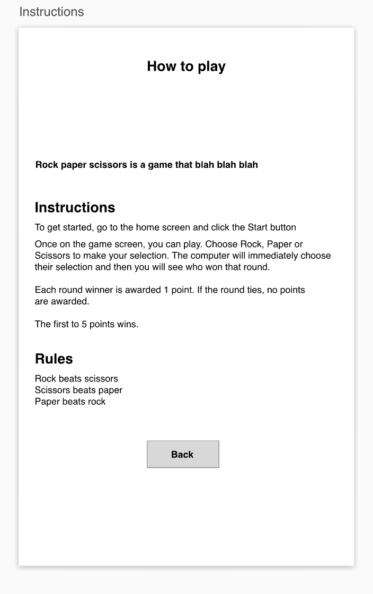
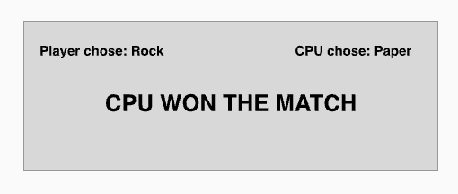
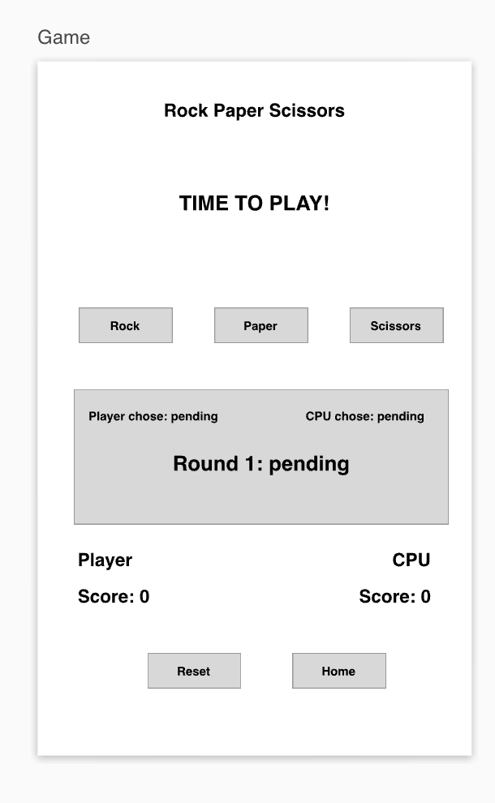
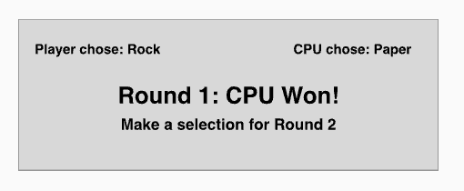

### ROCK PAPER SCISSORS

## How It Works?

The name of this game is Rock Paper Scissors. This game requires two players, Player One and The Computer. Each player will be given three options and will only be required to choose one for each game. The options are Rock, Paper and Scissors. The player will click a “Let’s Start” button that will take them to the game page.

Highlighted text will be displayed above each player indicating who’s turn to choose an option. Player One will be first to choose. After Player One makes its choice, the computer will choose a random play from these options. The results of each round will automatically be displayed after the Computer plays.

The results will be compared. Depending on the result, one of three alerts will be displayed indicating the winner:
If Player one wins - Player One Wins This Round,
If The Computer wins - The Computer Wins This Round,
If both players choose the same option - This Round Is a Tie!

One point will be added to a player’s score each time the player wins and no points will be allocated to either player if the game results in a Tie.

The game is designed where after a player reaches 5 wins that completes the end of the game and the game has to be reset in order to play a new game.

If Player One wins a screen will appear with a message saying “Congratulations You won the game!”. If The Computer wins this message will read “ You Lose. Better luck next time.

Once the Winner is displayed the only option available at this point would be to click the “Let’s Play again” button and the game will start over.

## What you will See

The first screen of the screen will have a heading of “Welcome to Rock Paper Scissor Game”. An image will be below this text of the game’s hand options. There will be two buttons below this images marked “How to Play” and “Let’s Start”.

How to Play Button
When clicked, it will show a brief description of the game and how its played. A ‘back’ button will be present on this screen. This will take you back to the home screen.

Let’s Start button
This brings you to the start of the game. Here you can make your first play.

On the game screen there will be three buttons that will be used to make the choices. A button labeled “Reset” will be on this screen and can be clicked at anytime during the course of the game. This button will allow you to restart the game at any point.
However, once a player’s score reaches 5 wins, this button will no longer be accessible and the rock paper and scissors buttons will be made disable.
You|CPU Won the match will be on the screen at this point. A “Home” and “ Play Again” buttons will be on this screen. The Home button will take you to the home screen. This will also reset all ‘plays’, ‘scores’ and ‘rounds’. The Play Again button will do the same, however, you will remain on the Play screen.

### Actions and State management

Page navigation
To move between pages, set all the page to hidden and set the page you want to visible

Game (global)
Round: 1
You
Choice: null
Score: 0
cpu
Choice: null
Score: 0

Round 1
You choose rock, paper or scissors by pressing the button

In this application, 0 means rock, 1 means paper, 2 means scissors

When a button a pressed, assign a value to the game.you.choice property
If it is the rock button, assign 0
If it is the paper button assign 1
If it is the scissors button, assign 2

Then, generate a choice for the cpu. This choice will be 0, 1 or 2.
Then, assign the generated choice to game.cpu.choice

Now that we have both choices, we need to determine who won!

Determine who won:

If Player chose 0 (rock)

If game.you.choice === game.cpu.choice then
winner = false

If game.cpu.choice === 2
winner = ‘you’

If payer chose

Function judge (): returns false|you|cpu

Then there is a function who receives the value of who won or loss or if it is a tie

Function assignPoints(winner false|you|cpu)
If false, do nothing
If you, increment score for game.you.score by 1
If cpu, increment score for game.cpu.score by 1

Update the game screen
On the screen, there is a paragraph that says:

“You chose: waiting” is there only until we replace it with what was actually chosen by the player

We want to change the word waiting to a word that represents what the player chose. So if they chose rock, then we want it to show the word “Rock”. If they chose paper, we want it to show the word “Paper”

On the screen, there is a paragraph that says:
“CPU chose: waiting” where “waiting” is there only until we replace it with what was actually chosen by the CPU

We want to change the word waiting to a word that represents what the CPU chose. So if the CPU chose rock, then we want it to show the word “Rock”. If the CPU chose paper, we want it to show the word “Paper”

Set player score to the value of game.player.score
Set CPU score to the value of game.cpu.score

Show the someone has won text:
CPU | YOU won!
Or if it is a tie:
It is a tie!

Check if CPU or Player score = 5
If so, then show the YOU|CPU have won the match screen
Disable the Rock paper scissors buttons
Change reset button to play again button

Otherwise

Reset button:
This sets the game.you.score to 0
This sets teh game.cpu.score to 0
Sets the game.cpu.choice to null
Sets teh game.you.choice to null
Sets the game.round to 1
Refreshes the text on the page to reflect these values

Play again button
Does everything above and also enables the rock paper scissors button
And shows the reset button instead of the play again button

computerGeneratedPlay()
Computer will generate a random number from 0 - 2
where:
0 == rock
1 == paper
2 == scissors

judge function()
This will take one parameter : Player One 
The Computer random choice
If
Player One chooses Rock and Computer Chooses Scissors
Or
Player One chooses Paper and Computer Chooses Rock
Or
Player One chooses Scissors and Computer Chooses Paper
Execute this :
Assign winner text (You Won!) 
Return
p1Win
Else if
computerGeneratedPlay === Rock and Player One Chooses Scissors
Or
computerGeneratedPlay === Paper and Player One Chooses Rock
Or
computerGeneratedPlay === Sicssors and Player One Chooses Paper
Execute this :
Assign winner text (The Computer won! Try again next time”) 
Return
Winner
Else
It’s a Tie!

Score function()
This will take two parameters : Player One and The Computer
PlayerOne =
Add 1 point until points are === to 5
However, if
The Computer =
Add 1 point until points are === to 5
Else if
PlayerOne {selection} and Computer {selection} === rock
Or
PlayerOne {selection} and Computer {selection} === paper
Or
PlayerOne {selection} and Computer {selection} === scissors
return
Alert ‘It’s a Tie’
Points will not be incremented but will remain the same

FinalWinner function()
When player One Points are === to 5
Display
Round 1 You Won
Else
When The Computer Points are === to 5
Display
Round 1 CPU Won

Reset function()
When the reset button is pressed all player scores will return to 0

Playagain function()
When the playagain button is pressed all player scores will return to 0 and return to the game page

